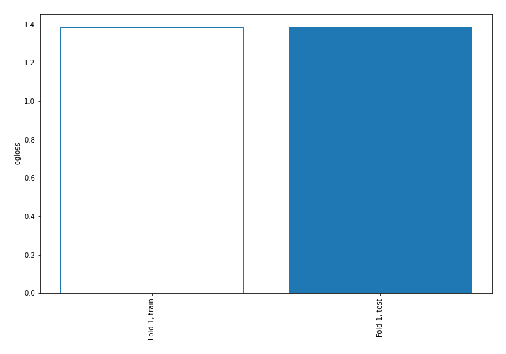
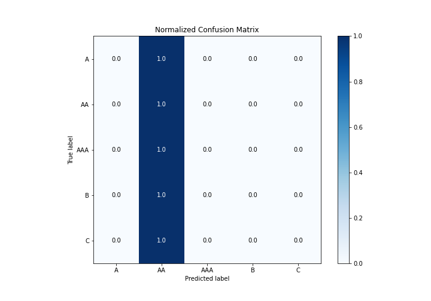
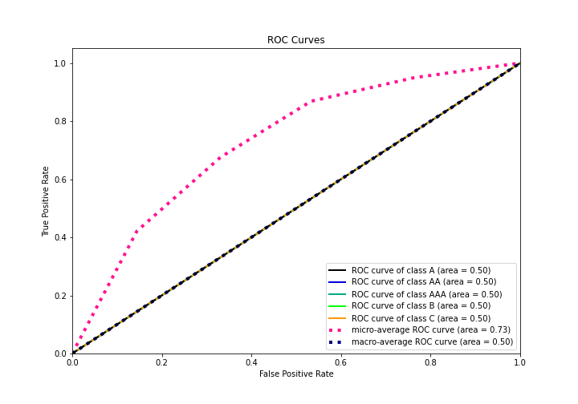
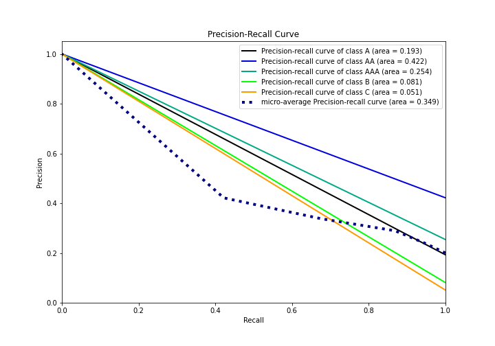

# Summary of 1_Baseline

[<< Go back](../README.md)

## Baseline Classifier (Baseline)
- **n_jobs**: -1
- **num_class**: 5
- **explain_level**: 2

## Validation
 - **validation_type**: split
 - **train_ratio**: 0.75
 - **shuffle**: True
 - **stratify**: True

## Optimized metric
logloss

## Training time

0.6 seconds

### Metric details
|           |   A |          AA |   AAA |   B |   C |   accuracy |    macro avg |   weighted avg |   logloss |
|:----------|----:|------------:|------:|----:|----:|-----------:|-------------:|---------------:|----------:|
| precision |   0 |    0.421744 |     0 |   0 |   0 |   0.421744 |    0.0843488 |       0.177868 |    1.3842 |
| recall    |   0 |    1        |     0 |   0 |   0 |   0.421744 |    0.2       |       0.421744 |    1.3842 |
| f1-score  |   0 |    0.593277 |     0 |   0 |   0 |   0.421744 |    0.118655  |       0.250211 |    1.3842 |
| support   | 528 | 1156        |   696 | 222 | 139 |   0.421744 | 2741         |    2741        |    1.3842 |

## Confusion matrix
|                |   Predicted as A |   Predicted as AA |   Predicted as AAA |   Predicted as B |   Predicted as C |
|:---------------|-----------------:|------------------:|-------------------:|-----------------:|-----------------:|
| Labeled as A   |                0 |               528 |                  0 |                0 |                0 |
| Labeled as AA  |                0 |              1156 |                  0 |                0 |                0 |
| Labeled as AAA |                0 |               696 |                  0 |                0 |                0 |
| Labeled as B   |                0 |               222 |                  0 |                0 |                0 |
| Labeled as C   |                0 |               139 |                  0 |                0 |                0 |

## Learning curves

## Confusion Matrix

## Normalized Confusion Matrix

## ROC Curve

## Precision Recall Curve

[<< Go back](../README.md)
