# Summary of 2_DecisionTree

[<< Go back](../README.md)

## Decision Tree
- **n_jobs**: -1
- **criterion**: gini
- **max_depth**: 3
- **num_class**: 5
- **explain_level**: 2

## Validation
 - **validation_type**: split
 - **train_ratio**: 0.75
 - **shuffle**: True
 - **stratify**: True

## Optimized metric
logloss

## Training time

22.1 seconds

### Metric details
|           |          A |          AA |        AAA |          B |          C |   accuracy |   macro avg |   weighted avg |   logloss |
|:----------|-----------:|------------:|-----------:|-----------:|-----------:|-----------:|------------:|---------------:|----------:|
| precision |   0.574307 |    0.648649 |   0.668682 |   0.704348 |   0.928571 |   0.653411 |    0.704911 |       0.658122 |  0.914449 |
| recall    |   0.431818 |    0.747405 |   0.79454  |   0.364865 |   0.467626 |   0.653411 |    0.561251 |       0.653411 |  0.914449 |
| f1-score  |   0.492973 |    0.694534 |   0.726198 |   0.480712 |   0.62201  |   0.653411 |    0.603285 |       0.642752 |  0.914449 |
| support   | 528        | 1156        | 696        | 222        | 139        |   0.653411 | 2741        |    2741        |  0.914449 |

## Confusion matrix
|                |   Predicted as A |   Predicted as AA |   Predicted as AAA |   Predicted as B |   Predicted as C |
|:---------------|-----------------:|------------------:|-------------------:|-----------------:|-----------------:|
| Labeled as A   |              228 |               262 |                 23 |               12 |                3 |
| Labeled as AA  |               47 |               864 |                243 |                1 |                1 |
| Labeled as AAA |                4 |               139 |                553 |                0 |                0 |
| Labeled as B   |               87 |                46 |                  7 |               81 |                1 |
| Labeled as C   |               31 |                21 |                  1 |               21 |               65 |

## Learning curves
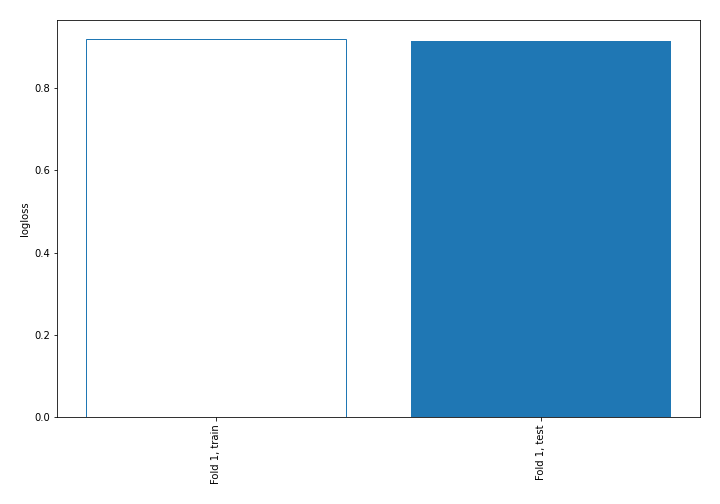

## Decision Tree 

### Tree #1
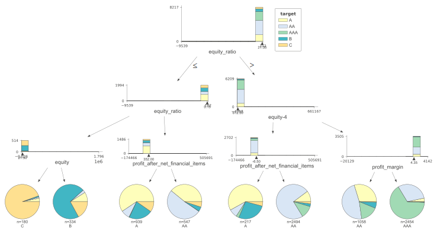

### Rules

if (equity_ratio > 21.35) and (equity-4 <= 612.5) and (profit_after_net_financial_items > -6.5) then class: AA (proba: 73.54%) | based on 2,494 samples

if (equity_ratio > 21.35) and (equity-4 > 612.5) and (profit_margin > 4.35) then class: AAA (proba: 65.65%) | based on 2,454 samples

if (equity_ratio > 21.35) and (equity-4 > 612.5) and (profit_margin <= 4.35) then class: AA (proba: 47.45%) | based on 1,058 samples

if (equity_ratio <= 21.35) and (equity_ratio > 5.15) and (profit_after_net_financial_items <= 352.0) then class: A (proba: 59.42%) | based on 939 samples

if (equity_ratio <= 21.35) and (equity_ratio > 5.15) and (profit_after_net_financial_items > 352.0) then class: AA (proba: 51.37%) | based on 547 samples

if (equity_ratio <= 21.35) and (equity_ratio <= 5.15) and (equity > 21.5) then class: B (proba: 71.26%) | based on 334 samples

if (equity_ratio > 21.35) and (equity-4 <= 612.5) and (profit_after_net_financial_items <= -6.5) then class: A (proba: 58.06%) | based on 217 samples

if (equity_ratio <= 21.35) and (equity_ratio <= 5.15) and (equity <= 21.5) then class: C (proba: 94.44%) | based on 180 samples

## Permutation-based Importance
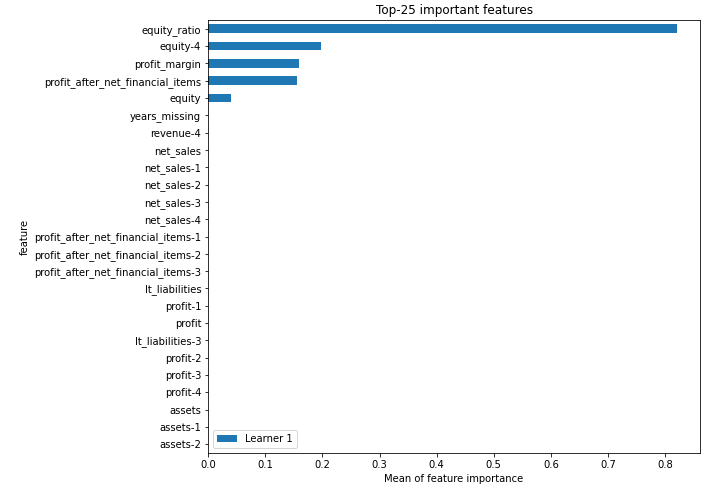
## Confusion Matrix

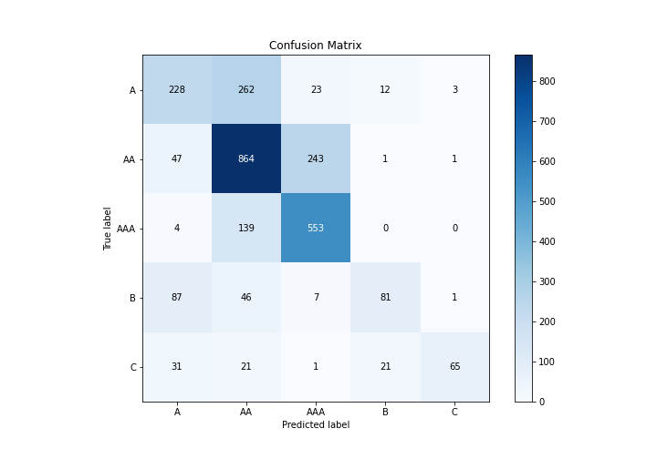

## Normalized Confusion Matrix

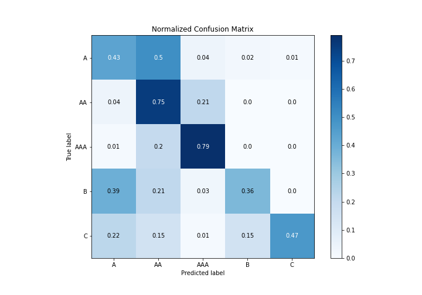

## ROC Curve

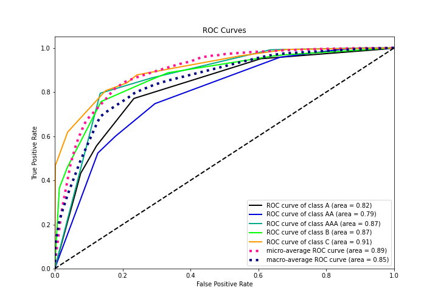

## Precision Recall Curve

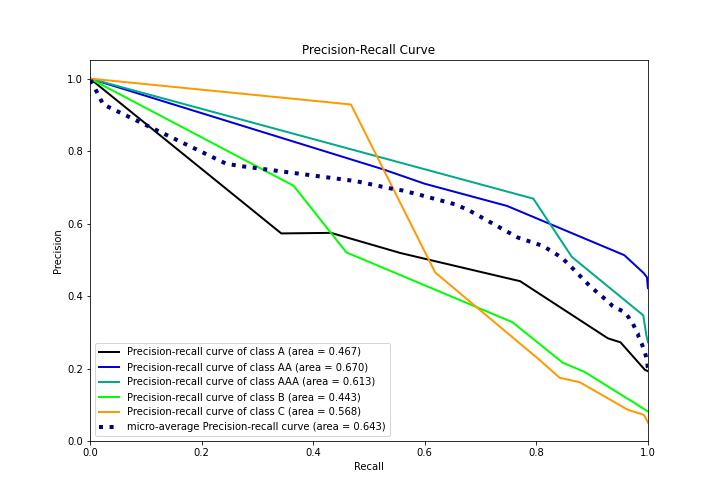

## SHAP Importance
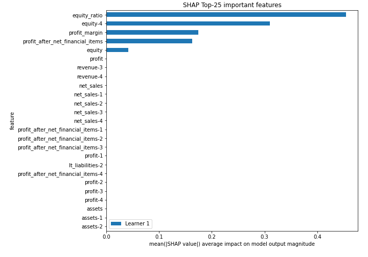

## SHAP Dependence plots

### Dependence A (Fold 1)
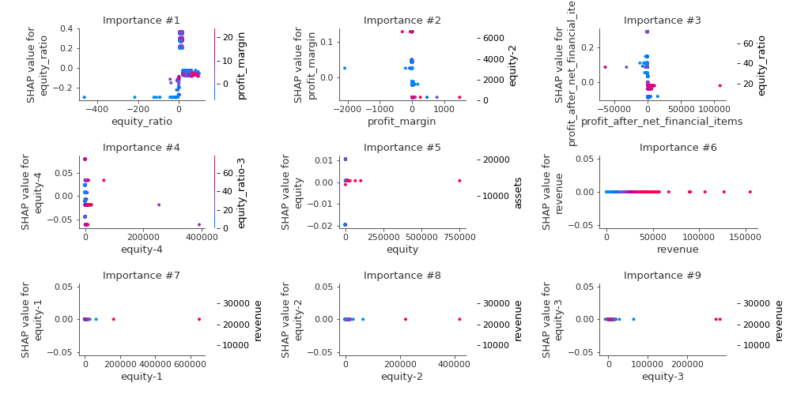
### Dependence AA (Fold 1)
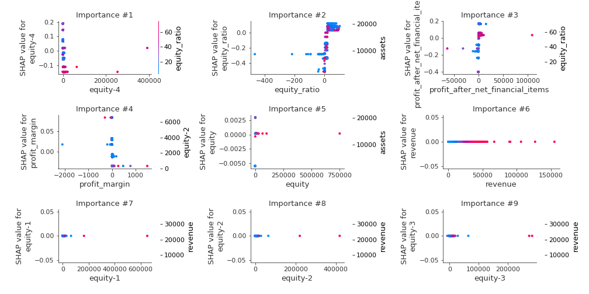
### Dependence AAA (Fold 1)
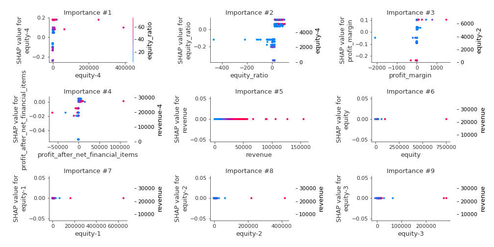
### Dependence B (Fold 1)
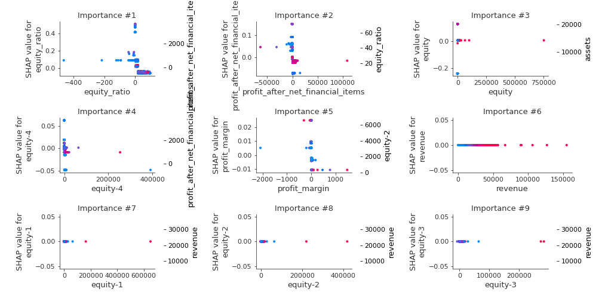
### Dependence C (Fold 1)
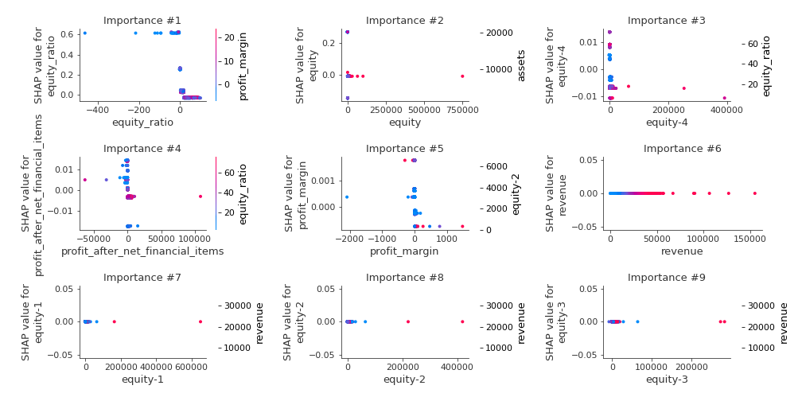

## SHAP Decision plots

### Worst decisions for selected sample 1 (Fold 1)
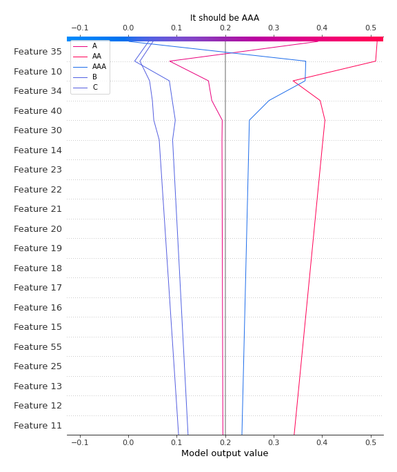
### Worst decisions for selected sample 2 (Fold 1)
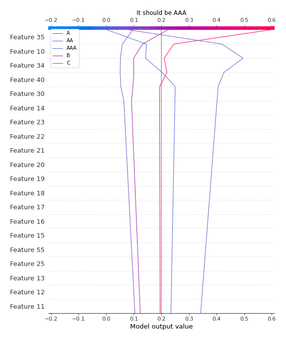
### Worst decisions for selected sample 3 (Fold 1)
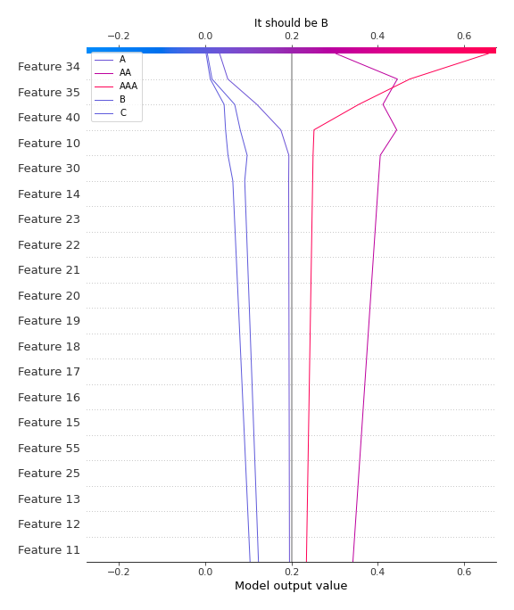
### Worst decisions for selected sample 4 (Fold 1)

### Best decisions for selected sample 1 (Fold 1)

### Best decisions for selected sample 2 (Fold 1)

### Best decisions for selected sample 3 (Fold 1)
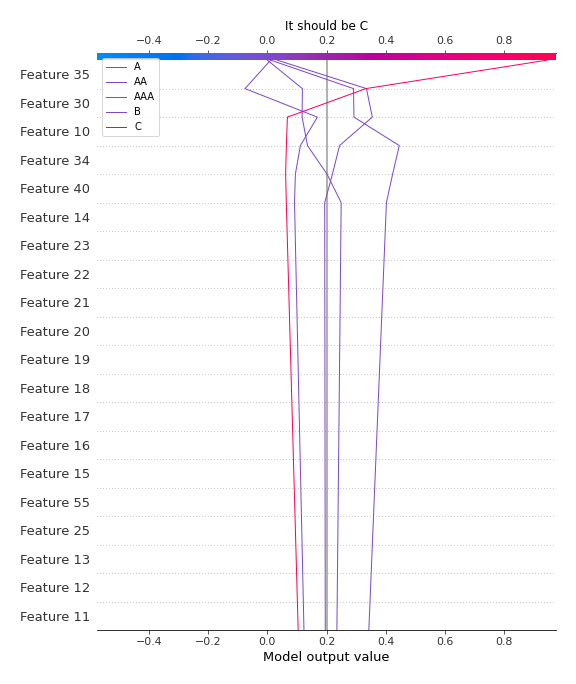
### Best decisions for selected sample 4 (Fold 1)

[<< Go back](../README.md)
