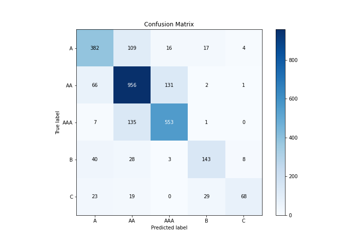

# Summary of 3_Default_Xgboost

[<< Go back](../README.md)

## Extreme Gradient Boosting (Xgboost)
- **n_jobs**: -1
- **objective**: multi:softprob
- **eta**: 0.075
- **max_depth**: 6
- **min_child_weight**: 1
- **subsample**: 1.0
- **colsample_bytree**: 1.0
- **eval_metric**: mlogloss
- **num_class**: 5
- **explain_level**: 2

## Validation
 - **validation_type**: split
 - **train_ratio**: 0.75
 - **shuffle**: True
 - **stratify**: True

## Optimized metric
logloss

## Training time

29.3 seconds

### Metric details
|           |          A |          AA |        AAA |          B |          C |   accuracy |   macro avg |   weighted avg |   logloss |
|:----------|-----------:|------------:|-----------:|-----------:|-----------:|-----------:|------------:|---------------:|----------:|
| precision |   0.737452 |    0.76664  |   0.786629 |   0.744792 |   0.839506 |   0.766873 |    0.775004 |       0.768019 |  0.646849 |
| recall    |   0.723485 |    0.82699  |   0.79454  |   0.644144 |   0.489209 |   0.766873 |    0.695673 |       0.766873 |  0.646849 |
| f1-score  |   0.730402 |    0.795672 |   0.790565 |   0.690821 |   0.618182 |   0.766873 |    0.725128 |       0.764309 |  0.646849 |
| support   | 528        | 1156        | 696        | 222        | 139        |   0.766873 | 2741        |    2741        |  0.646849 |

## Confusion matrix
|                |   Predicted as A |   Predicted as AA |   Predicted as AAA |   Predicted as B |   Predicted as C |
|:---------------|-----------------:|------------------:|-------------------:|-----------------:|-----------------:|
| Labeled as A   |              382 |               109 |                 16 |               17 |                4 |
| Labeled as AA  |               66 |               956 |                131 |                2 |                1 |
| Labeled as AAA |                7 |               135 |                553 |                1 |                0 |
| Labeled as B   |               40 |                28 |                  3 |              143 |                8 |
| Labeled as C   |               23 |                19 |                  0 |               29 |               68 |

## Learning curves

## Permutation-based Importance

## Confusion Matrix

## Normalized Confusion Matrix

## ROC Curve

## Precision Recall Curve

## SHAP Importance

[<< Go back](../README.md)
