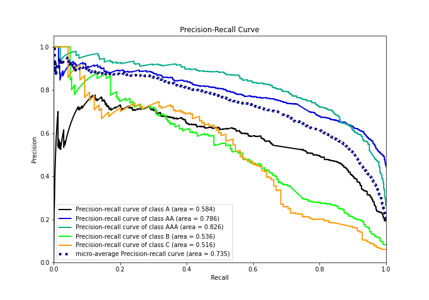

# Summary of 4_Default_NeuralNetwork

[<< Go back](../README.md)

## Neural Network
- **n_jobs**: -1
- **dense_1_size**: 32
- **dense_2_size**: 16
- **learning_rate**: 0.05
- **num_class**: 5
- **explain_level**: 2

## Validation
 - **validation_type**: split
 - **train_ratio**: 0.75
 - **shuffle**: True
 - **stratify**: True

## Optimized metric
logloss

## Training time

7.4 seconds

### Metric details
|           |          A |          AA |        AAA |          B |          C |   accuracy |   macro avg |   weighted avg |   logloss |
|:----------|-----------:|------------:|-----------:|-----------:|-----------:|-----------:|------------:|---------------:|----------:|
| precision |   0.594705 |    0.698476 |   0.727034 |   0.594444 |   0.704918 |   0.681138 |    0.663916 |       0.677639 |  0.867564 |
| recall    |   0.55303  |    0.75346  |   0.795977 |   0.481982 |   0.309353 |   0.681138 |    0.57876  |       0.681138 |  0.867564 |
| f1-score  |   0.573111 |    0.724927 |   0.759945 |   0.532338 |   0.43     |   0.681138 |    0.604064 |       0.67402  |  0.867564 |
| support   | 528        | 1156        | 696        | 222        | 139        |   0.681138 | 2741        |    2741        |  0.867564 |

## Confusion matrix
|                |   Predicted as A |   Predicted as AA |   Predicted as AAA |   Predicted as B |   Predicted as C |
|:---------------|-----------------:|------------------:|-------------------:|-----------------:|-----------------:|
| Labeled as A   |              292 |               183 |                 19 |               28 |                6 |
| Labeled as AA  |               97 |               871 |                186 |                2 |                0 |
| Labeled as AAA |                3 |               138 |                554 |                0 |                1 |
| Labeled as B   |               70 |                32 |                  2 |              107 |               11 |
| Labeled as C   |               29 |                23 |                  1 |               43 |               43 |

## Learning curves

## Permutation-based Importance

## Confusion Matrix

## Normalized Confusion Matrix

## ROC Curve

## Precision Recall Curve

[<< Go back](../README.md)
