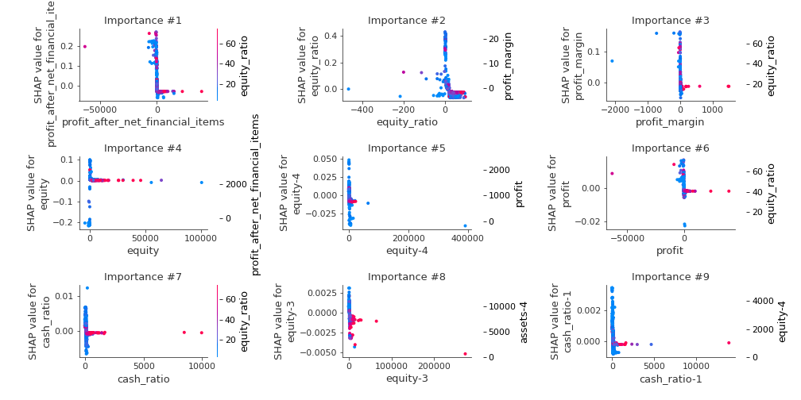

# Summary of 5_Default_RandomForest

[<< Go back](../README.md)

## Random Forest
- **n_jobs**: -1
- **criterion**: gini
- **max_features**: 0.9
- **min_samples_split**: 30
- **max_depth**: 4
- **eval_metric_name**: logloss
- **num_class**: 5
- **explain_level**: 2

## Validation
 - **validation_type**: split
 - **train_ratio**: 0.75
 - **shuffle**: True
 - **stratify**: True

## Optimized metric
logloss

## Training time

25.0 seconds

### Metric details
|           |          A |          AA |        AAA |          B |          C |   accuracy |   macro avg |   weighted avg |   logloss |
|:----------|-----------:|------------:|-----------:|-----------:|-----------:|-----------:|------------:|---------------:|----------:|
| precision |   0.660194 |    0.715582 |   0.760606 |   0.687861 |   0.929577 |    0.71981 |    0.750764 |       0.724952 |  0.790339 |
| recall    |   0.643939 |    0.818339 |   0.721264 |   0.536036 |   0.47482  |    0.71981 |    0.63888  |       0.71981  |  0.790339 |
| f1-score  |   0.651965 |    0.763519 |   0.740413 |   0.602532 |   0.628571 |    0.71981 |    0.6774   |       0.716281 |  0.790339 |
| support   | 528        | 1156        | 696        | 222        | 139        |    0.71981 | 2741        |    2741        |  0.790339 |

## Confusion matrix
|                |   Predicted as A |   Predicted as AA |   Predicted as AAA |   Predicted as B |   Predicted as C |
|:---------------|-----------------:|------------------:|-------------------:|-----------------:|-----------------:|
| Labeled as A   |              340 |               151 |                 15 |               19 |                3 |
| Labeled as AA  |               64 |               946 |                139 |                6 |                1 |
| Labeled as AAA |               10 |               183 |                502 |                1 |                0 |
| Labeled as B   |               74 |                25 |                  3 |              119 |                1 |
| Labeled as C   |               27 |                17 |                  1 |               28 |               66 |

## Learning curves

## Permutation-based Importance

## Confusion Matrix

## Normalized Confusion Matrix

## ROC Curve

## Precision Recall Curve

## SHAP Importance

## SHAP Dependence plots

### Dependence A (Fold 1)

### Dependence AA (Fold 1)

### Dependence AAA (Fold 1)

### Dependence B (Fold 1)

### Dependence C (Fold 1)

## SHAP Decision plots

### Worst decisions for selected sample 1 (Fold 1)

### Worst decisions for selected sample 2 (Fold 1)

### Worst decisions for selected sample 3 (Fold 1)

### Worst decisions for selected sample 4 (Fold 1)

### Best decisions for selected sample 1 (Fold 1)

### Best decisions for selected sample 2 (Fold 1)

### Best decisions for selected sample 3 (Fold 1)

### Best decisions for selected sample 4 (Fold 1)

[<< Go back](../README.md)
