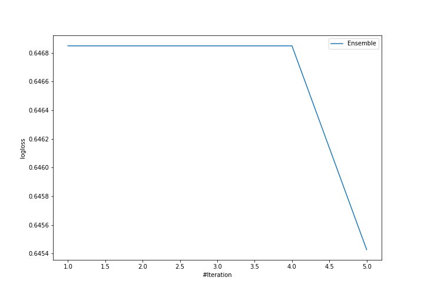
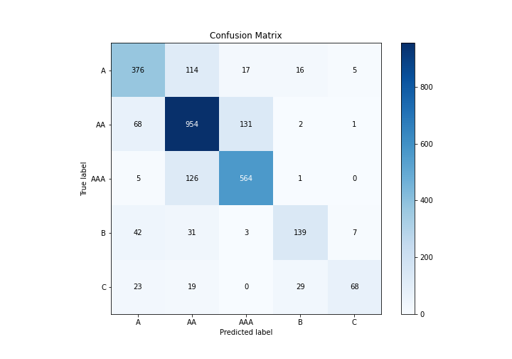
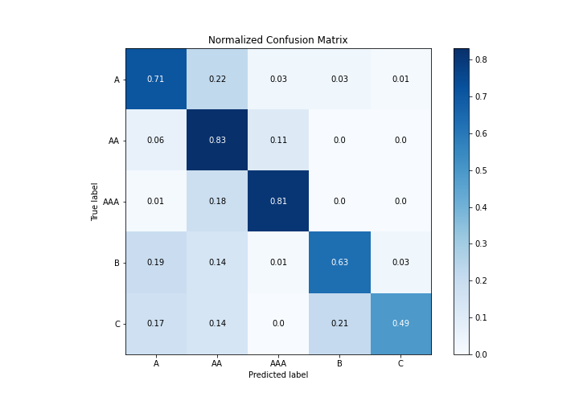
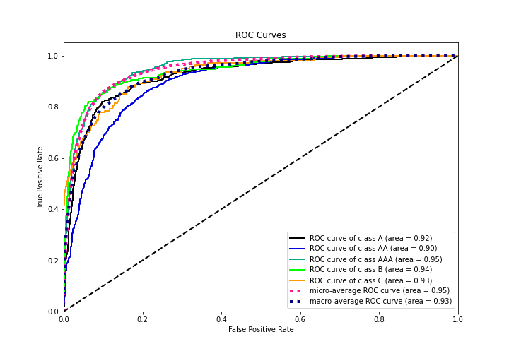
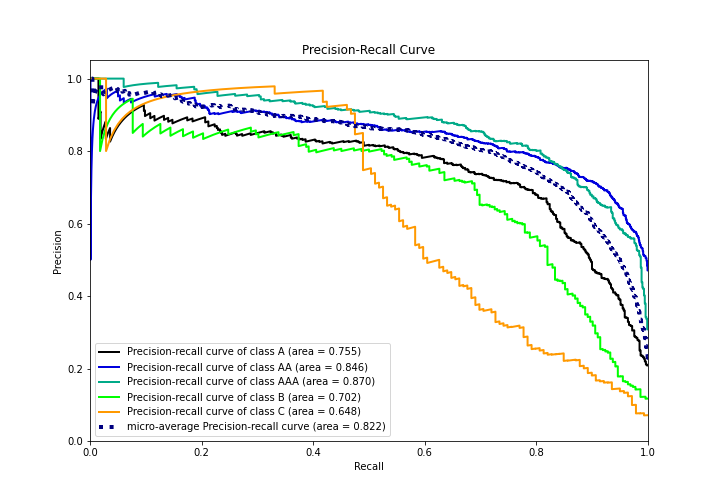

# Summary of Ensemble

[<< Go back](../README.md)

## Ensemble structure
| Model                   |   Weight |
|:------------------------|---------:|
| 3_Default_Xgboost       |        4 |
| 4_Default_NeuralNetwork |        1 |

### Metric details
|           |          A |          AA |        AAA |          B |          C |   accuracy |   macro avg |   weighted avg |   logloss |
|:----------|-----------:|------------:|-----------:|-----------:|-----------:|-----------:|------------:|---------------:|----------:|
| precision |   0.731518 |    0.766881 |   0.788811 |   0.743316 |   0.839506 |   0.766509 |    0.774006 |       0.767412 |  0.645427 |
| recall    |   0.712121 |    0.82526  |   0.810345 |   0.626126 |   0.489209 |   0.766509 |    0.692612 |       0.766509 |  0.645427 |
| f1-score  |   0.721689 |    0.795    |   0.799433 |   0.679707 |   0.618182 |   0.766509 |    0.722802 |       0.763699 |  0.645427 |
| support   | 528        | 1156        | 696        | 222        | 139        |   0.766509 | 2741        |    2741        |  0.645427 |

## Confusion matrix
|                |   Predicted as A |   Predicted as AA |   Predicted as AAA |   Predicted as B |   Predicted as C |
|:---------------|-----------------:|------------------:|-------------------:|-----------------:|-----------------:|
| Labeled as A   |              376 |               114 |                 17 |               16 |                5 |
| Labeled as AA  |               68 |               954 |                131 |                2 |                1 |
| Labeled as AAA |                5 |               126 |                564 |                1 |                0 |
| Labeled as B   |               42 |                31 |                  3 |              139 |                7 |
| Labeled as C   |               23 |                19 |                  0 |               29 |               68 |

## Learning curves

## Confusion Matrix

## Normalized Confusion Matrix

## ROC Curve

## Precision Recall Curve

[<< Go back](../README.md)
