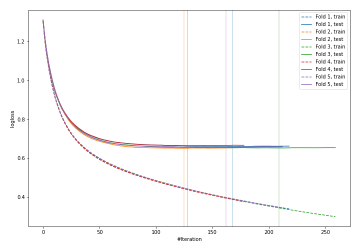
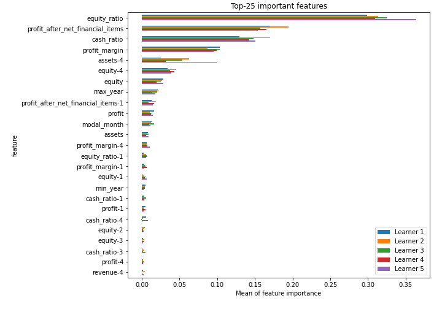
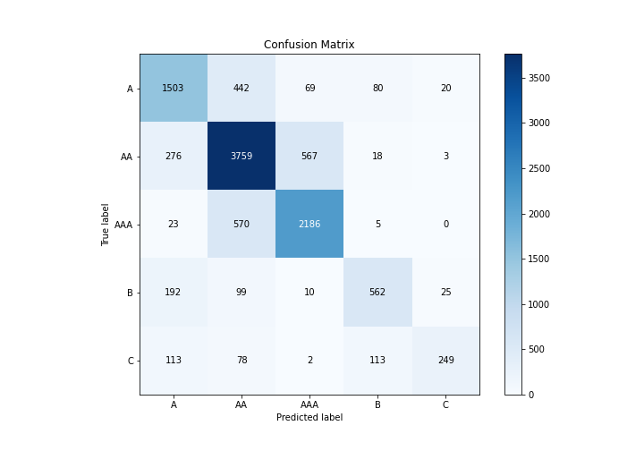
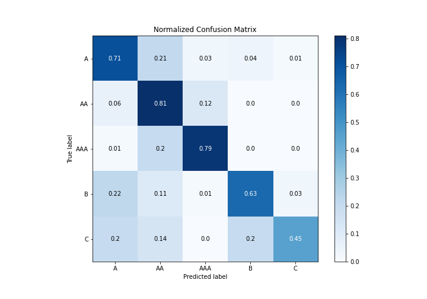
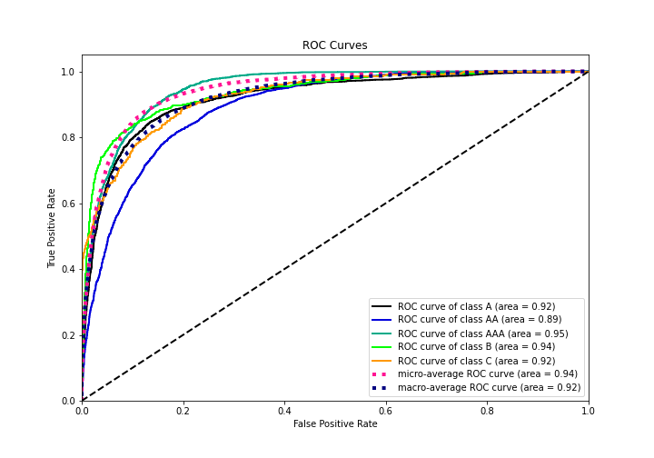
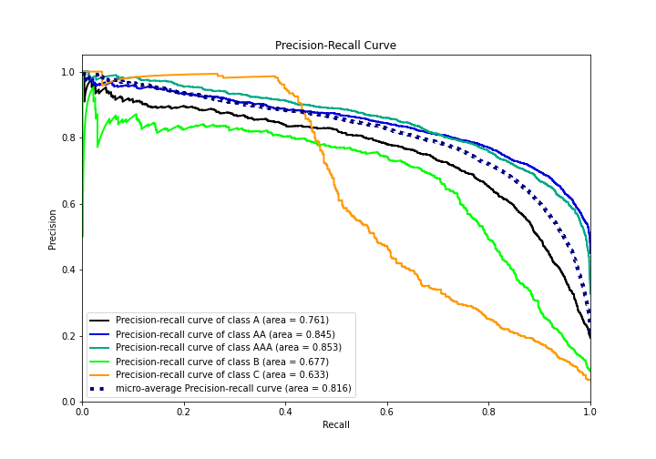

# Summary of 10_LightGBM

[<< Go back](../README.md)

## LightGBM
- **n_jobs**: -1
- **objective**: multiclass
- **num_leaves**: 15
- **learning_rate**: 0.05
- **feature_fraction**: 0.8
- **bagging_fraction**: 0.5
- **min_data_in_leaf**: 50
- **metric**: multi_logloss
- **custom_eval_metric_name**: None
- **num_class**: 5
- **explain_level**: 1

## Validation
 - **validation_type**: kfold
 - **k_folds**: 5
 - **shuffle**: True
 - **stratify**: True

## Optimized metric
logloss

## Training time

73.1 seconds

### Metric details
|           |           A |          AA |         AAA |          B |          C |   accuracy |    macro avg |   weighted avg |   logloss |
|:----------|------------:|------------:|------------:|-----------:|-----------:|-----------:|-------------:|---------------:|----------:|
| precision |    0.713336 |    0.759701 |    0.771348 |   0.722365 |   0.838384 |   0.753283 |     0.761027 |       0.754678 |  0.656651 |
| recall    |    0.710974 |    0.813108 |    0.785201 |   0.632883 |   0.448649 |   0.753283 |     0.678163 |       0.753283 |  0.656651 |
| f1-score  |    0.712154 |    0.785498 |    0.778213 |   0.67467  |   0.584507 |   0.753283 |     0.707008 |       0.750356 |  0.656651 |
| support   | 2114        | 4623        | 2784        | 888        | 555        |   0.753283 | 10964        |   10964        |  0.656651 |

## Confusion matrix
|                |   Predicted as A |   Predicted as AA |   Predicted as AAA |   Predicted as B |   Predicted as C |
|:---------------|-----------------:|------------------:|-------------------:|-----------------:|-----------------:|
| Labeled as A   |             1503 |               442 |                 69 |               80 |               20 |
| Labeled as AA  |              276 |              3759 |                567 |               18 |                3 |
| Labeled as AAA |               23 |               570 |               2186 |                5 |                0 |
| Labeled as B   |              192 |                99 |                 10 |              562 |               25 |
| Labeled as C   |              113 |                78 |                  2 |              113 |              249 |

## Learning curves

## Permutation-based Importance

## Confusion Matrix

## Normalized Confusion Matrix

## ROC Curve

## Precision Recall Curve

[<< Go back](../README.md)
