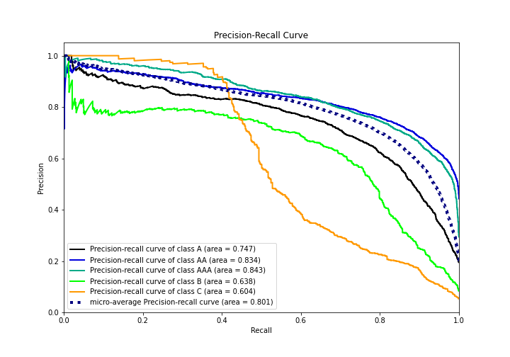

# Summary of 11_LightGBM

[<< Go back](../README.md)

## LightGBM
- **n_jobs**: -1
- **objective**: multiclass
- **num_leaves**: 63
- **learning_rate**: 0.2
- **feature_fraction**: 0.5
- **bagging_fraction**: 1.0
- **min_data_in_leaf**: 10
- **metric**: multi_logloss
- **custom_eval_metric_name**: None
- **num_class**: 5
- **explain_level**: 1

## Validation
 - **validation_type**: kfold
 - **k_folds**: 5
 - **shuffle**: True
 - **stratify**: True

## Optimized metric
logloss

## Training time

26.8 seconds

### Metric details
|           |           A |          AA |         AAA |          B |          C |   accuracy |    macro avg |   weighted avg |   logloss |
|:----------|------------:|------------:|------------:|-----------:|-----------:|-----------:|-------------:|---------------:|----------:|
| precision |    0.703125 |    0.752567 |    0.759194 |   0.70069  |   0.743976 |   0.741062 |     0.73191  |       0.74008  |  0.697807 |
| recall    |    0.70246  |    0.808566 |    0.771193 |   0.572072 |   0.445045 |   0.741062 |     0.659867 |       0.741062 |  0.697807 |
| f1-score  |    0.702792 |    0.779562 |    0.765146 |   0.629882 |   0.556933 |   0.741062 |     0.686863 |       0.737707 |  0.697807 |
| support   | 2114        | 4623        | 2784        | 888        | 555        |   0.741062 | 10964        |   10964        |  0.697807 |

## Confusion matrix
|                |   Predicted as A |   Predicted as AA |   Predicted as AAA |   Predicted as B |   Predicted as C |
|:---------------|-----------------:|------------------:|-------------------:|-----------------:|-----------------:|
| Labeled as A   |             1485 |               447 |                 67 |               86 |               29 |
| Labeled as AA  |              258 |              3738 |                599 |               19 |                9 |
| Labeled as AAA |               31 |               601 |               2147 |                5 |                0 |
| Labeled as B   |              220 |               102 |                 11 |              508 |               47 |
| Labeled as C   |              118 |                79 |                  4 |              107 |              247 |

## Learning curves

## Permutation-based Importance

## Confusion Matrix

## Normalized Confusion Matrix

## ROC Curve

## Precision Recall Curve

[<< Go back](../README.md)
