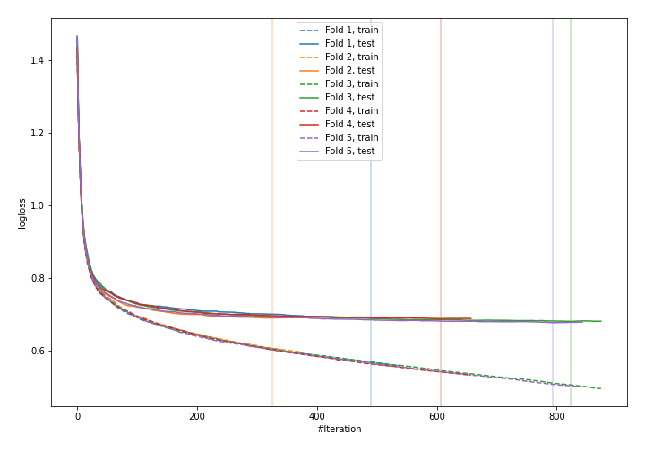
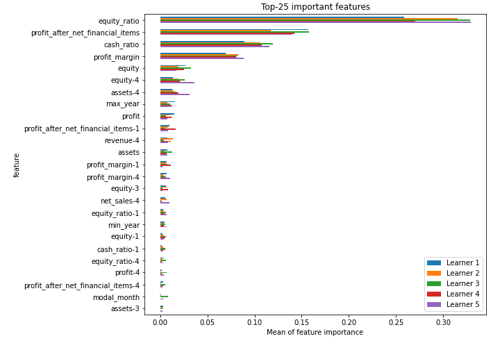
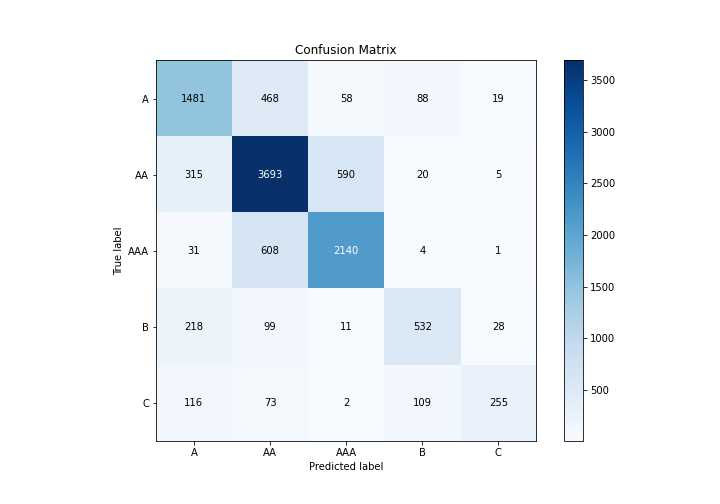
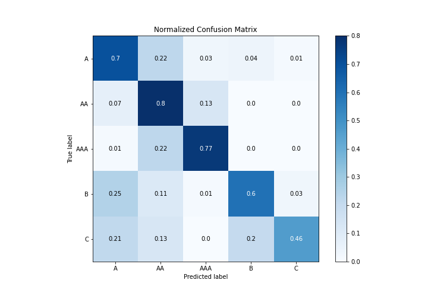
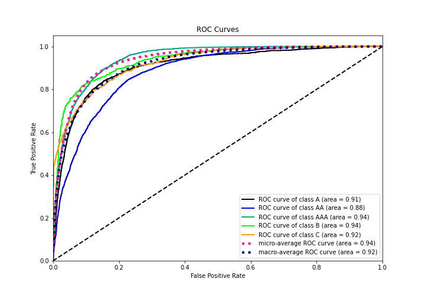
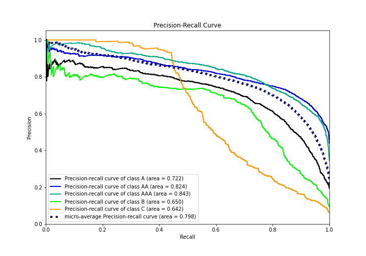

# Summary of 14_CatBoost

[<< Go back](../README.md)

## CatBoost
- **n_jobs**: -1
- **learning_rate**: 0.15
- **depth**: 3
- **rsm**: 0.8
- **loss_function**: MultiClass
- **eval_metric**: MultiClass
- **num_class**: 5
- **explain_level**: 1

## Validation
 - **validation_type**: kfold
 - **k_folds**: 5
 - **shuffle**: True
 - **stratify**: True

## Optimized metric
logloss

## Training time

80.8 seconds

### Metric details
|           |           A |          AA |         AAA |          B |          C |   accuracy |    macro avg |   weighted avg |   logloss |
|:----------|------------:|------------:|------------:|-----------:|-----------:|-----------:|-------------:|---------------:|----------:|
| precision |    0.685331 |    0.74742  |    0.764013 |   0.706507 |   0.827922 |   0.738873 |     0.746239 |       0.740423 |   0.68582 |
| recall    |    0.700568 |    0.798832 |    0.768678 |   0.599099 |   0.459459 |   0.738873 |     0.665327 |       0.738873 |   0.68582 |
| f1-score  |    0.692865 |    0.772271 |    0.766338 |   0.648385 |   0.590962 |   0.738873 |     0.694164 |       0.736242 |   0.68582 |
| support   | 2114        | 4623        | 2784        | 888        | 555        |   0.738873 | 10964        |   10964        |   0.68582 |

## Confusion matrix
|                |   Predicted as A |   Predicted as AA |   Predicted as AAA |   Predicted as B |   Predicted as C |
|:---------------|-----------------:|------------------:|-------------------:|-----------------:|-----------------:|
| Labeled as A   |             1481 |               468 |                 58 |               88 |               19 |
| Labeled as AA  |              315 |              3693 |                590 |               20 |                5 |
| Labeled as AAA |               31 |               608 |               2140 |                4 |                1 |
| Labeled as B   |              218 |                99 |                 11 |              532 |               28 |
| Labeled as C   |              116 |                73 |                  2 |              109 |              255 |

## Learning curves

## Permutation-based Importance

## Confusion Matrix

## Normalized Confusion Matrix

## ROC Curve

## Precision Recall Curve

[<< Go back](../README.md)
