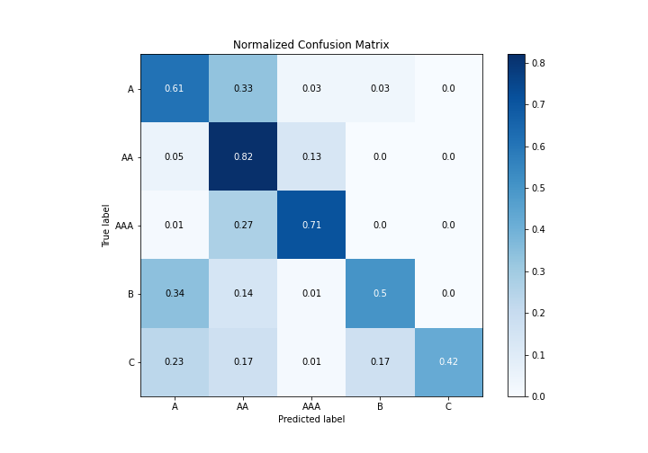

# Summary of 18_RandomForest

[<< Go back](../README.md)

## Random Forest
- **n_jobs**: -1
- **criterion**: gini
- **max_features**: 0.5
- **min_samples_split**: 20
- **max_depth**: 4
- **eval_metric_name**: logloss
- **num_class**: 5
- **explain_level**: 1

## Validation
 - **validation_type**: kfold
 - **k_folds**: 5
 - **shuffle**: True
 - **stratify**: True

## Optimized metric
logloss

## Training time

18.5 seconds

### Metric details
|           |           A |          AA |         AAA |          B |          C |   accuracy |    macro avg |   weighted avg |   logloss |
|:----------|------------:|------------:|------------:|-----------:|-----------:|-----------:|-------------:|---------------:|----------:|
| precision |    0.647767 |    0.694245 |    0.749623 |   0.704114 |   0.935484 |   0.705217 |     0.746247 |       0.712356 |  0.812579 |
| recall    |    0.610691 |    0.816786 |    0.71408  |   0.501126 |   0.418018 |   0.705217 |     0.61214  |       0.705217 |  0.812579 |
| f1-score  |    0.628683 |    0.750547 |    0.73142  |   0.585526 |   0.577833 |   0.705217 |     0.654802 |       0.700085 |  0.812579 |
| support   | 2114        | 4623        | 2784        | 888        | 555        |   0.705217 | 10964        |   10964        |  0.812579 |

## Confusion matrix
|                |   Predicted as A |   Predicted as AA |   Predicted as AAA |   Predicted as B |   Predicted as C |
|:---------------|-----------------:|------------------:|-------------------:|-----------------:|-----------------:|
| Labeled as A   |             1291 |               688 |                 58 |               68 |                9 |
| Labeled as AA  |              232 |              3776 |                594 |               18 |                3 |
| Labeled as AAA |               36 |               756 |               1988 |                4 |                0 |
| Labeled as B   |              304 |               126 |                  9 |              445 |                4 |
| Labeled as C   |              130 |                93 |                  3 |               97 |              232 |

## Learning curves

## Permutation-based Importance

## Confusion Matrix

## Normalized Confusion Matrix

## ROC Curve

## Precision Recall Curve

[<< Go back](../README.md)
