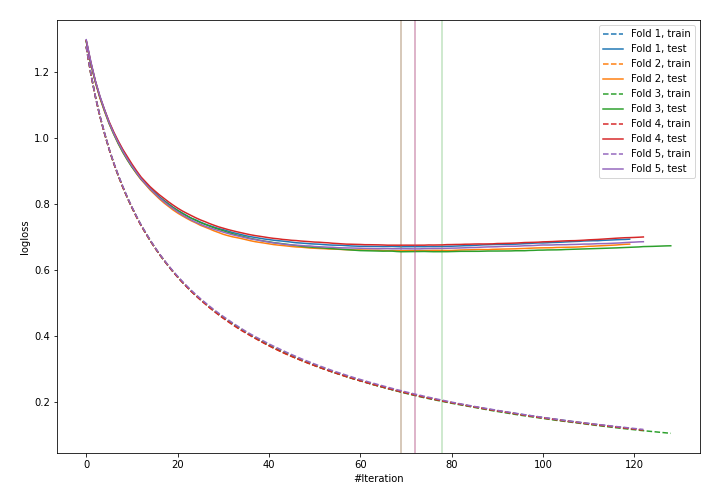
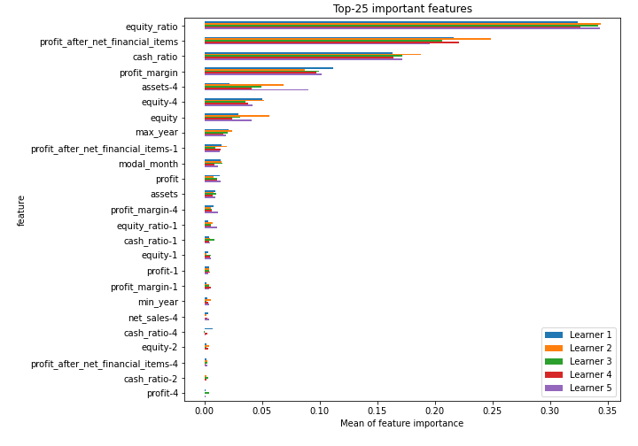
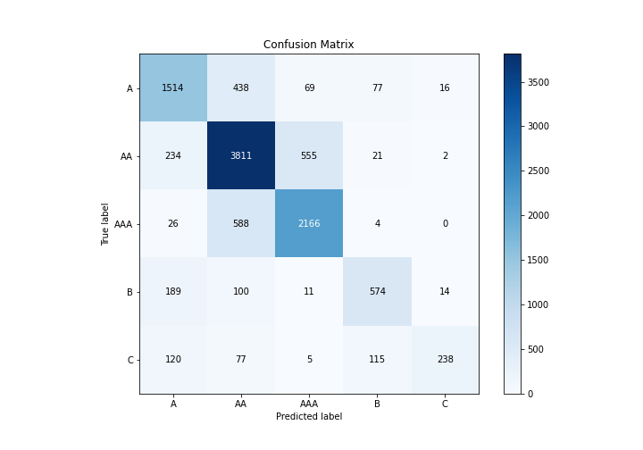
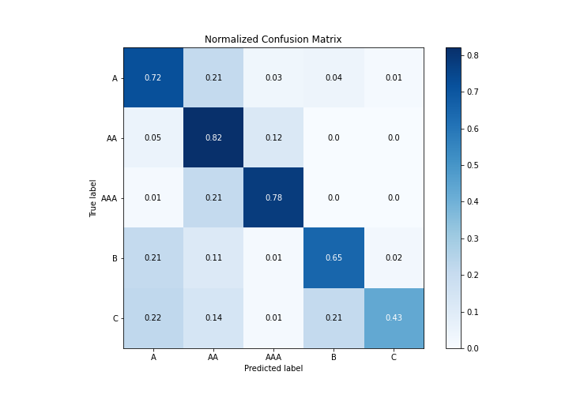
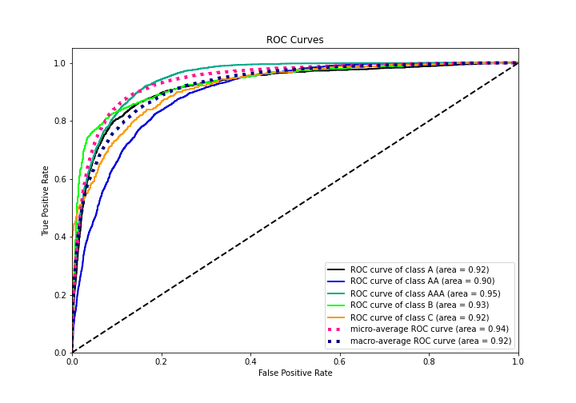
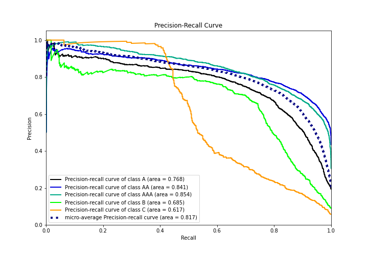

# Summary of 1_Default_LightGBM

[<< Go back](../README.md)

## LightGBM
- **n_jobs**: -1
- **objective**: multiclass
- **num_leaves**: 63
- **learning_rate**: 0.05
- **feature_fraction**: 0.9
- **bagging_fraction**: 0.9
- **min_data_in_leaf**: 10
- **metric**: multi_logloss
- **custom_eval_metric_name**: None
- **num_class**: 5
- **explain_level**: 1

## Validation
 - **validation_type**: kfold
 - **k_folds**: 5
 - **shuffle**: True
 - **stratify**: True

## Optimized metric
logloss

## Training time

76.6 seconds

### Metric details
|           |           A |          AA |         AAA |          B |          C |   accuracy |    macro avg |   weighted avg |   logloss |
|:----------|------------:|------------:|------------:|-----------:|-----------:|-----------:|-------------:|---------------:|----------:|
| precision |    0.726836 |    0.760072 |    0.771917 |   0.725664 |   0.881481 |   0.757297 |     0.773194 |       0.76003  |  0.664186 |
| recall    |    0.716178 |    0.824356 |    0.778017 |   0.646396 |   0.428829 |   0.757297 |     0.678755 |       0.757297 |  0.664186 |
| f1-score  |    0.721468 |    0.79091  |    0.774955 |   0.68374  |   0.57697  |   0.757297 |     0.709609 |       0.75396  |  0.664186 |
| support   | 2114        | 4623        | 2784        | 888        | 555        |   0.757297 | 10964        |   10964        |  0.664186 |

## Confusion matrix
|                |   Predicted as A |   Predicted as AA |   Predicted as AAA |   Predicted as B |   Predicted as C |
|:---------------|-----------------:|------------------:|-------------------:|-----------------:|-----------------:|
| Labeled as A   |             1514 |               438 |                 69 |               77 |               16 |
| Labeled as AA  |              234 |              3811 |                555 |               21 |                2 |
| Labeled as AAA |               26 |               588 |               2166 |                4 |                0 |
| Labeled as B   |              189 |               100 |                 11 |              574 |               14 |
| Labeled as C   |              120 |                77 |                  5 |              115 |              238 |

## Learning curves

## Permutation-based Importance

## Confusion Matrix

## Normalized Confusion Matrix

## ROC Curve

## Precision Recall Curve

[<< Go back](../README.md)
