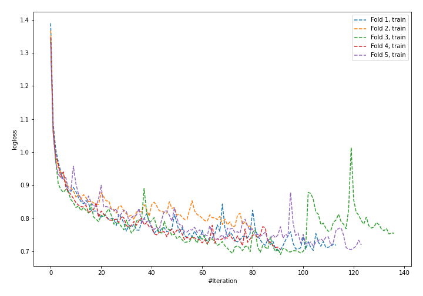
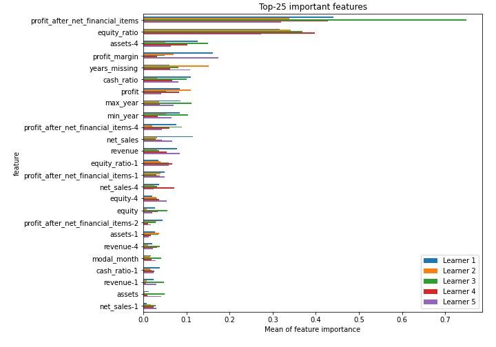
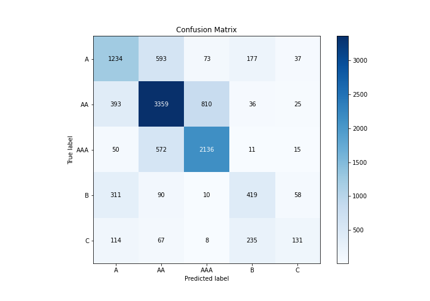
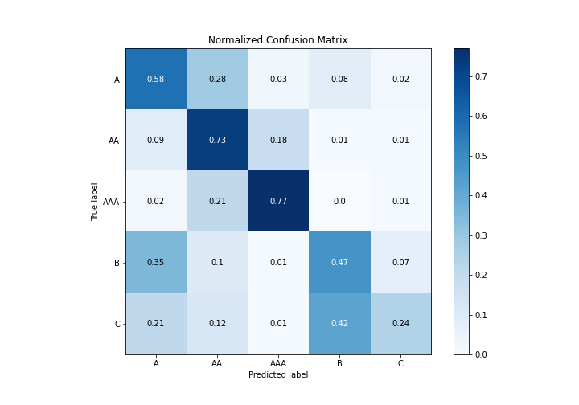
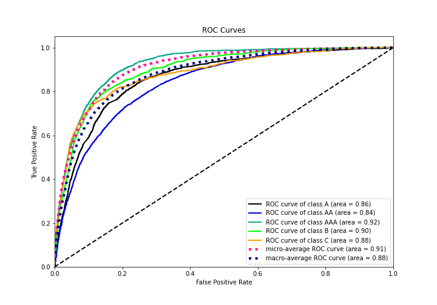
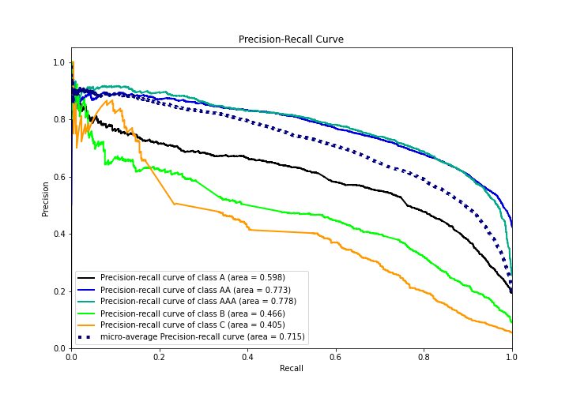

# Summary of 22_NeuralNetwork

[<< Go back](../README.md)

## Neural Network
- **n_jobs**: -1
- **dense_1_size**: 32
- **dense_2_size**: 4
- **learning_rate**: 0.05
- **num_class**: 5
- **explain_level**: 1

## Validation
 - **validation_type**: kfold
 - **k_folds**: 5
 - **shuffle**: True
 - **stratify**: True

## Optimized metric
logloss

## Training time

30.4 seconds

### Metric details
|           |           A |          AA |         AAA |          B |          C |   accuracy |    macro avg |   weighted avg |   logloss |
|:----------|------------:|------------:|------------:|-----------:|-----------:|-----------:|-------------:|---------------:|----------:|
| precision |    0.58706  |    0.717582 |    0.703326 |   0.477221 |   0.492481 |     0.6639 |     0.595534 |       0.657933 |  0.877256 |
| recall    |    0.583728 |    0.726584 |    0.767241 |   0.471847 |   0.236036 |     0.6639 |     0.557087 |       0.6639   |  0.877256 |
| f1-score  |    0.585389 |    0.722055 |    0.733895 |   0.474519 |   0.319123 |     0.6639 |     0.566996 |       0.658265 |  0.877256 |
| support   | 2114        | 4623        | 2784        | 888        | 555        |     0.6639 | 10964        |   10964        |  0.877256 |

## Confusion matrix
|                |   Predicted as A |   Predicted as AA |   Predicted as AAA |   Predicted as B |   Predicted as C |
|:---------------|-----------------:|------------------:|-------------------:|-----------------:|-----------------:|
| Labeled as A   |             1234 |               593 |                 73 |              177 |               37 |
| Labeled as AA  |              393 |              3359 |                810 |               36 |               25 |
| Labeled as AAA |               50 |               572 |               2136 |               11 |               15 |
| Labeled as B   |              311 |                90 |                 10 |              419 |               58 |
| Labeled as C   |              114 |                67 |                  8 |              235 |              131 |

## Learning curves

## Permutation-based Importance

## Confusion Matrix

## Normalized Confusion Matrix

## ROC Curve

## Precision Recall Curve

[<< Go back](../README.md)
