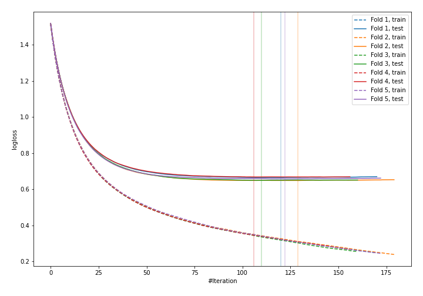
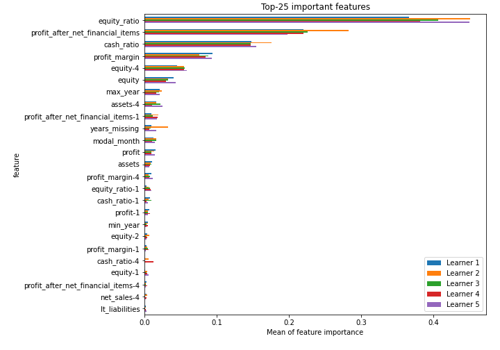
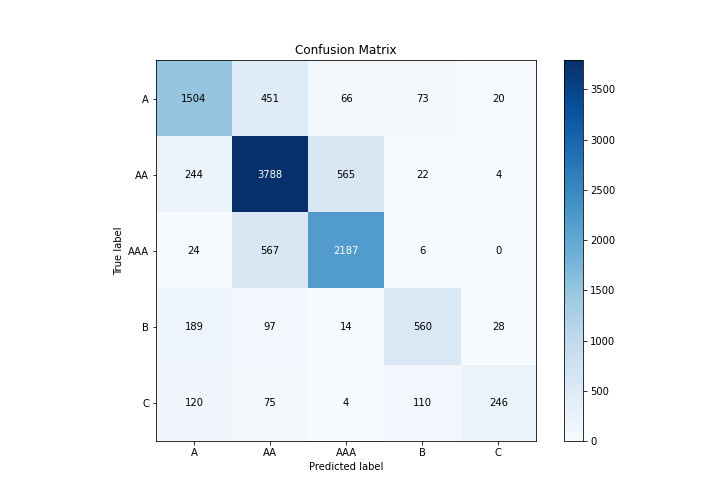
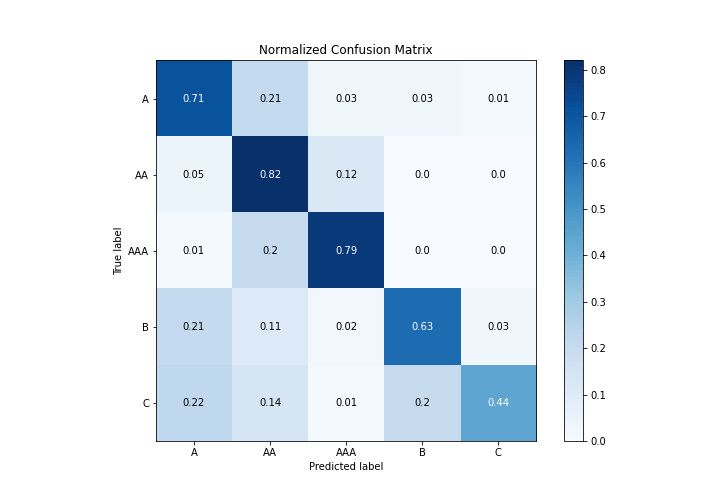
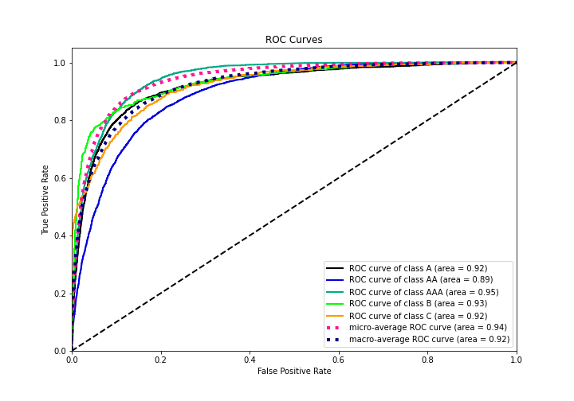
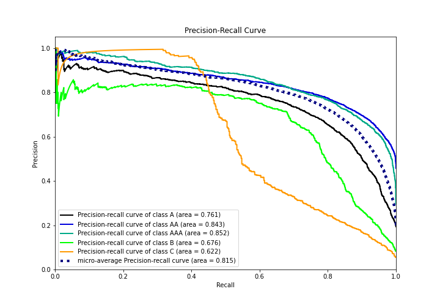

# Summary of 2_Default_Xgboost

[<< Go back](../README.md)

## Extreme Gradient Boosting (Xgboost)
- **n_jobs**: -1
- **objective**: multi:softprob
- **eta**: 0.075
- **max_depth**: 6
- **min_child_weight**: 1
- **subsample**: 1.0
- **colsample_bytree**: 1.0
- **eval_metric**: mlogloss
- **num_class**: 5
- **explain_level**: 1

## Validation
 - **validation_type**: kfold
 - **k_folds**: 5
 - **shuffle**: True
 - **stratify**: True

## Optimized metric
logloss

## Training time

120.4 seconds

### Metric details
|           |           A |          AA |         AAA |          B |          C |   accuracy |    macro avg |   weighted avg |   logloss |
|:----------|------------:|------------:|------------:|-----------:|-----------:|-----------:|-------------:|---------------:|----------:|
| precision |    0.722729 |    0.760948 |    0.771157 |   0.726329 |   0.825503 |   0.755655 |     0.761333 |       0.756635 |  0.657047 |
| recall    |    0.711447 |    0.819381 |    0.78556  |   0.630631 |   0.443243 |   0.755655 |     0.678053 |       0.755655 |  0.657047 |
| f1-score  |    0.717044 |    0.789084 |    0.778292 |   0.675105 |   0.576788 |   0.755655 |     0.707263 |       0.752476 |  0.657047 |
| support   | 2114        | 4623        | 2784        | 888        | 555        |   0.755655 | 10964        |   10964        |  0.657047 |

## Confusion matrix
|                |   Predicted as A |   Predicted as AA |   Predicted as AAA |   Predicted as B |   Predicted as C |
|:---------------|-----------------:|------------------:|-------------------:|-----------------:|-----------------:|
| Labeled as A   |             1504 |               451 |                 66 |               73 |               20 |
| Labeled as AA  |              244 |              3788 |                565 |               22 |                4 |
| Labeled as AAA |               24 |               567 |               2187 |                6 |                0 |
| Labeled as B   |              189 |                97 |                 14 |              560 |               28 |
| Labeled as C   |              120 |                75 |                  4 |              110 |              246 |

## Learning curves

## Permutation-based Importance

## Confusion Matrix

## Normalized Confusion Matrix

## ROC Curve

## Precision Recall Curve

[<< Go back](../README.md)
