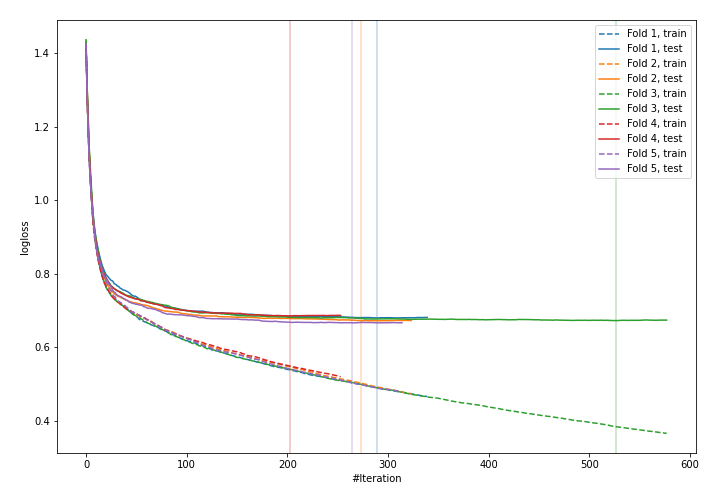
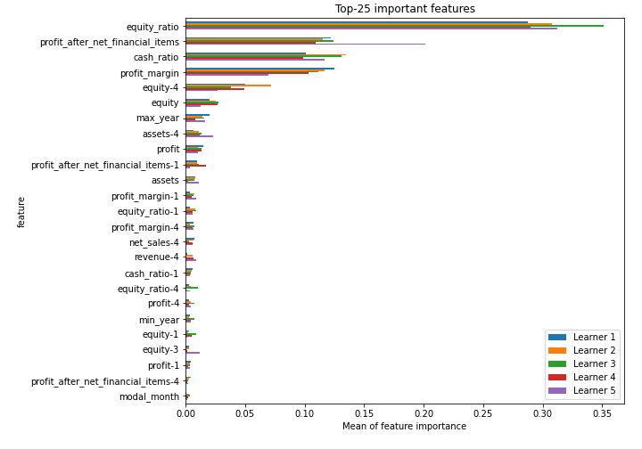
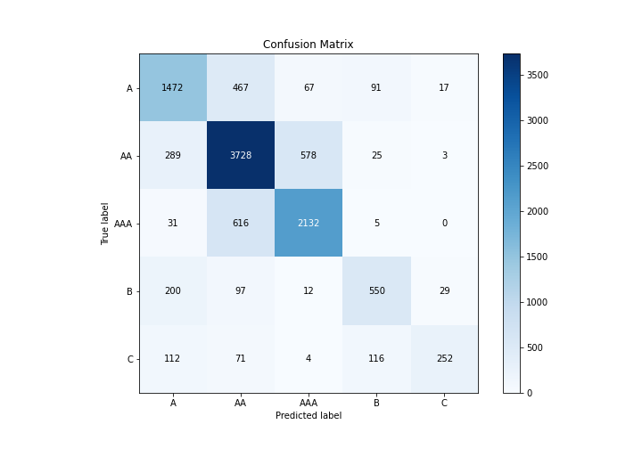
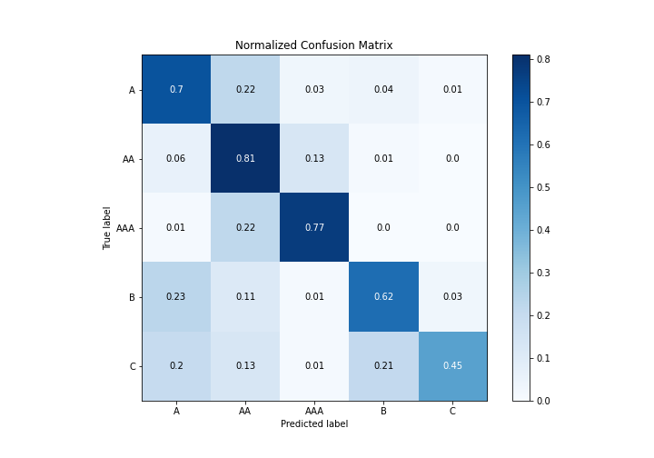
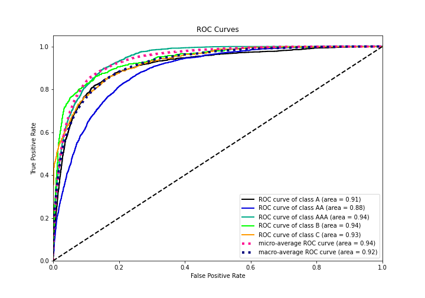
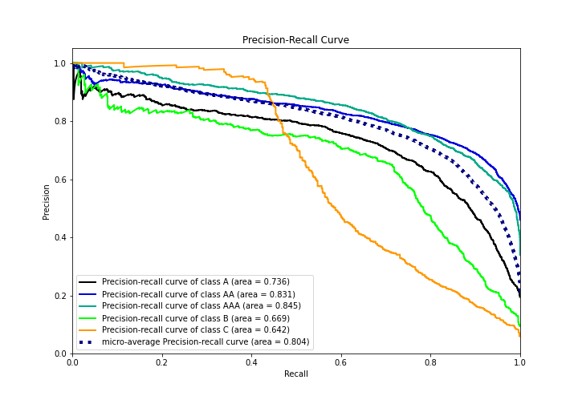

# Summary of 3_Default_CatBoost

[<< Go back](../README.md)

## CatBoost
- **n_jobs**: -1
- **learning_rate**: 0.15
- **depth**: 5
- **rsm**: 1
- **loss_function**: MultiClass
- **eval_metric**: MultiClass
- **num_class**: 5
- **explain_level**: 1

## Validation
 - **validation_type**: kfold
 - **k_folds**: 5
 - **shuffle**: True
 - **stratify**: True

## Optimized metric
logloss

## Training time

87.0 seconds

### Metric details
|           |           A |          AA |         AAA |          B |          C |   accuracy |    macro avg |   weighted avg |   logloss |
|:----------|------------:|------------:|------------:|-----------:|-----------:|-----------:|-------------:|---------------:|----------:|
| precision |    0.69962  |    0.748745 |    0.763337 |   0.698856 |   0.837209 |   0.741883 |     0.749553 |       0.743416 |  0.675474 |
| recall    |    0.69631  |    0.806403 |    0.765805 |   0.619369 |   0.454054 |   0.741883 |     0.668388 |       0.741883 |  0.675474 |
| f1-score  |    0.697961 |    0.776505 |    0.764569 |   0.656716 |   0.588785 |   0.741883 |     0.696907 |       0.739125 |  0.675474 |
| support   | 2114        | 4623        | 2784        | 888        | 555        |   0.741883 | 10964        |   10964        |  0.675474 |

## Confusion matrix
|                |   Predicted as A |   Predicted as AA |   Predicted as AAA |   Predicted as B |   Predicted as C |
|:---------------|-----------------:|------------------:|-------------------:|-----------------:|-----------------:|
| Labeled as A   |             1472 |               467 |                 67 |               91 |               17 |
| Labeled as AA  |              289 |              3728 |                578 |               25 |                3 |
| Labeled as AAA |               31 |               616 |               2132 |                5 |                0 |
| Labeled as B   |              200 |                97 |                 12 |              550 |               29 |
| Labeled as C   |              112 |                71 |                  4 |              116 |              252 |

## Learning curves

## Permutation-based Importance

## Confusion Matrix

## Normalized Confusion Matrix

## ROC Curve

## Precision Recall Curve

[<< Go back](../README.md)
