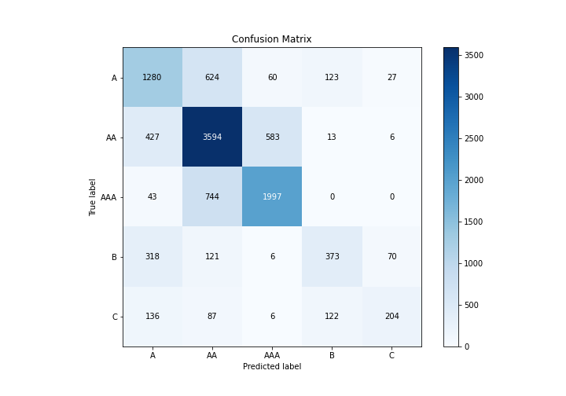

# Summary of 4_Default_NeuralNetwork

[<< Go back](../README.md)

## Neural Network
- **n_jobs**: -1
- **dense_1_size**: 32
- **dense_2_size**: 16
- **learning_rate**: 0.05
- **num_class**: 5
- **explain_level**: 1

## Validation
 - **validation_type**: kfold
 - **k_folds**: 5
 - **shuffle**: True
 - **stratify**: True

## Optimized metric
logloss

## Training time

35.7 seconds

### Metric details
|           |           A |          AA |         AAA |          B |          C |   accuracy |    macro avg |   weighted avg |   logloss |
|:----------|------------:|------------:|------------:|-----------:|-----------:|-----------:|-------------:|---------------:|----------:|
| precision |    0.580762 |    0.695164 |    0.753017 |   0.591125 |   0.664495 |   0.679314 |     0.656913 |       0.677817 |  0.865334 |
| recall    |    0.605487 |    0.777417 |    0.717313 |   0.420045 |   0.367568 |   0.679314 |     0.577566 |       0.679314 |  0.865334 |
| f1-score  |    0.592867 |    0.733994 |    0.734731 |   0.491113 |   0.473318 |   0.679314 |     0.605205 |       0.674103 |  0.865334 |
| support   | 2114        | 4623        | 2784        | 888        | 555        |   0.679314 | 10964        |   10964        |  0.865334 |

## Confusion matrix
|                |   Predicted as A |   Predicted as AA |   Predicted as AAA |   Predicted as B |   Predicted as C |
|:---------------|-----------------:|------------------:|-------------------:|-----------------:|-----------------:|
| Labeled as A   |             1280 |               624 |                 60 |              123 |               27 |
| Labeled as AA  |              427 |              3594 |                583 |               13 |                6 |
| Labeled as AAA |               43 |               744 |               1997 |                0 |                0 |
| Labeled as B   |              318 |               121 |                  6 |              373 |               70 |
| Labeled as C   |              136 |                87 |                  6 |              122 |              204 |

## Learning curves

## Permutation-based Importance

## Confusion Matrix

## Normalized Confusion Matrix

## ROC Curve

## Precision Recall Curve

[<< Go back](../README.md)
