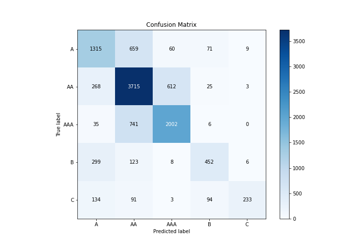
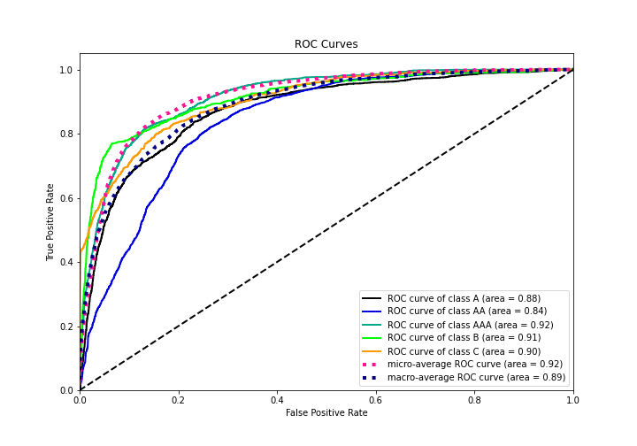

# Summary of 5_Default_RandomForest

[<< Go back](../README.md)

## Random Forest
- **n_jobs**: -1
- **criterion**: gini
- **max_features**: 0.9
- **min_samples_split**: 30
- **max_depth**: 4
- **eval_metric_name**: logloss
- **num_class**: 5
- **explain_level**: 1

## Validation
 - **validation_type**: kfold
 - **k_folds**: 5
 - **shuffle**: True
 - **stratify**: True

## Optimized metric
logloss

## Training time

31.5 seconds

### Metric details
|           |           A |          AA |         AAA |          B |          C |   accuracy |    macro avg |   weighted avg |   logloss |
|:----------|------------:|------------:|------------:|-----------:|-----------:|-----------:|-------------:|---------------:|----------:|
| precision |    0.641151 |    0.697129 |    0.745624 |   0.697531 |   0.928287 |   0.703849 |     0.741944 |       0.710383 |  0.813486 |
| recall    |    0.622044 |    0.803591 |    0.719109 |   0.509009 |   0.41982  |   0.703849 |     0.614714 |       0.703849 |  0.813486 |
| f1-score  |    0.631453 |    0.746584 |    0.732127 |   0.588542 |   0.578164 |   0.703849 |     0.655374 |       0.699388 |  0.813486 |
| support   | 2114        | 4623        | 2784        | 888        | 555        |   0.703849 | 10964        |   10964        |  0.813486 |

## Confusion matrix
|                |   Predicted as A |   Predicted as AA |   Predicted as AAA |   Predicted as B |   Predicted as C |
|:---------------|-----------------:|------------------:|-------------------:|-----------------:|-----------------:|
| Labeled as A   |             1315 |               659 |                 60 |               71 |                9 |
| Labeled as AA  |              268 |              3715 |                612 |               25 |                3 |
| Labeled as AAA |               35 |               741 |               2002 |                6 |                0 |
| Labeled as B   |              299 |               123 |                  8 |              452 |                6 |
| Labeled as C   |              134 |                91 |                  3 |               94 |              233 |

## Learning curves

## Permutation-based Importance

## Confusion Matrix

## Normalized Confusion Matrix

## ROC Curve

## Precision Recall Curve

[<< Go back](../README.md)
