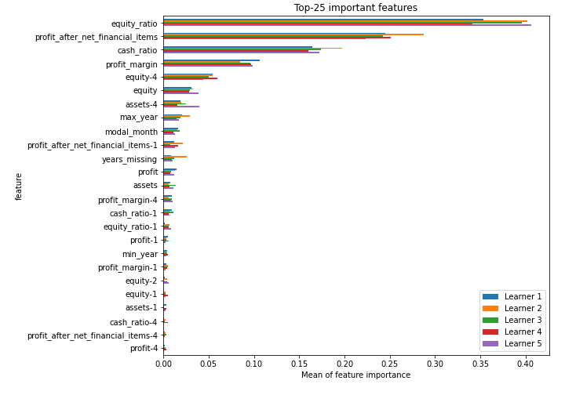

# Summary of 6_Xgboost

[<< Go back](../README.md)

## Extreme Gradient Boosting (Xgboost)
- **n_jobs**: -1
- **objective**: multi:softprob
- **eta**: 0.075
- **max_depth**: 8
- **min_child_weight**: 5
- **subsample**: 1.0
- **colsample_bytree**: 1.0
- **eval_metric**: mlogloss
- **num_class**: 5
- **explain_level**: 1

## Validation
 - **validation_type**: kfold
 - **k_folds**: 5
 - **shuffle**: True
 - **stratify**: True

## Optimized metric
logloss

## Training time

132.3 seconds

### Metric details
|           |           A |          AA |         AAA |          B |          C |   accuracy |    macro avg |   weighted avg |   logloss |
|:----------|------------:|------------:|------------:|-----------:|-----------:|-----------:|-------------:|---------------:|----------:|
| precision |    0.72701  |    0.763222 |    0.768451 |   0.720154 |   0.844068 |   0.756841 |     0.764581 |       0.758172 |  0.655772 |
| recall    |    0.714286 |    0.817867 |    0.789152 |   0.631757 |   0.448649 |   0.756841 |     0.680342 |       0.756841 |  0.655772 |
| f1-score  |    0.720592 |    0.7896   |    0.778664 |   0.673065 |   0.585882 |   0.756841 |     0.709561 |       0.753767 |  0.655772 |
| support   | 2114        | 4623        | 2784        | 888        | 555        |   0.756841 | 10964        |   10964        |  0.655772 |

## Confusion matrix
|                |   Predicted as A |   Predicted as AA |   Predicted as AAA |   Predicted as B |   Predicted as C |
|:---------------|-----------------:|------------------:|-------------------:|-----------------:|-----------------:|
| Labeled as A   |             1510 |               435 |                 72 |               80 |               17 |
| Labeled as AA  |              239 |              3781 |                575 |               24 |                4 |
| Labeled as AAA |               22 |               560 |               2197 |                5 |                0 |
| Labeled as B   |              190 |               100 |                 12 |              561 |               25 |
| Labeled as C   |              116 |                78 |                  3 |              109 |              249 |

## Learning curves

## Permutation-based Importance

## Confusion Matrix

## Normalized Confusion Matrix

## ROC Curve

## Precision Recall Curve

[<< Go back](../README.md)
