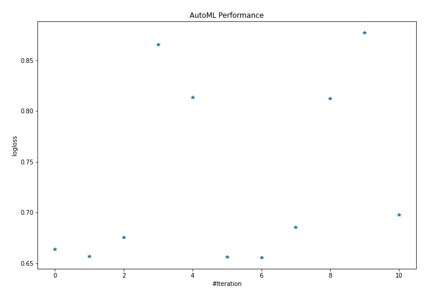
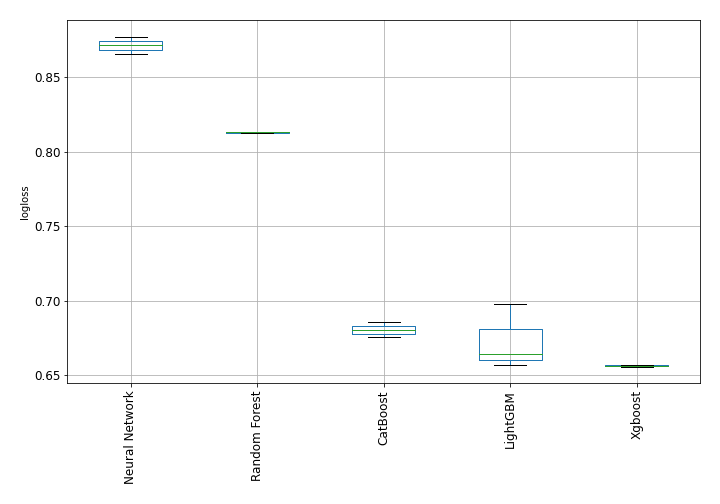

# AutoML Leaderboard

| Best model   | name                                                         | model_type     | metric_type   |   metric_value |   train_time |   single_prediction_time |
|:-------------|:-------------------------------------------------------------|:---------------|:--------------|---------------:|-------------:|-------------------------:|
|              | [1_Default_LightGBM](1_Default_LightGBM/README.md)           | LightGBM       | logloss       |       0.664186 |        77.62 |                   0.114  |
|              | [2_Default_Xgboost](2_Default_Xgboost/README.md)             | Xgboost        | logloss       |       0.657047 |       121.19 |                   0.134  |
|              | [3_Default_CatBoost](3_Default_CatBoost/README.md)           | CatBoost       | logloss       |       0.675474 |        87.9  |                   0.057  |
|              | [4_Default_NeuralNetwork](4_Default_NeuralNetwork/README.md) | Neural Network | logloss       |       0.865334 |        36.63 |                   0.124  |
|              | [5_Default_RandomForest](5_Default_RandomForest/README.md)   | Random Forest  | logloss       |       0.813486 |        32.46 |                   0.126  |
|              | [10_LightGBM](10_LightGBM/README.md)                         | LightGBM       | logloss       |       0.656651 |        74.01 |                   0.1296 |
| **the best** | [6_Xgboost](6_Xgboost/README.md)                             | Xgboost        | logloss       |       0.655772 |       133.11 |                   0.1297 |
|              | [14_CatBoost](14_CatBoost/README.md)                         | CatBoost       | logloss       |       0.68582  |        81.65 |                   0.059  |
|              | [18_RandomForest](18_RandomForest/README.md)                 | Random Forest  | logloss       |       0.812579 |        19.34 |                   0.105  |
|              | [22_NeuralNetwork](22_NeuralNetwork/README.md)               | Neural Network | logloss       |       0.877256 |        31.18 |                   0.1325 |
|              | [11_LightGBM](11_LightGBM/README.md)                         | LightGBM       | logloss       |       0.697807 |        26.84 |                   0.123  |

### AutoML Performance

### AutoML Performance Boxplot
